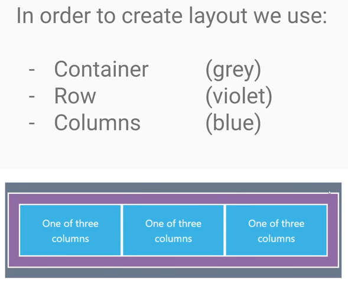

# Bootstrap 5 tutorial - crash course for beginners in 1.5H (stable release May 2021)

https://www.youtube.com/watch?v=rQryOSyfXmI

https://github.com/mdbootstrap/knowledge-base/tree/main/x-in-one-video/Bootstrap5

## Contents

- [Bootstrap 5 tutorial - crash course for beginners in 1.5H (stable release May 2021)](#bootstrap-5-tutorial---crash-course-for-beginners-in-15h-stable-release-may-2021)
  - [Contents](#contents)
  - [01. Introduction](#01-introduction)
    - [What is Bootstrap?](#what-is-bootstrap)
    - [Why use Bootstrap](#why-use-bootstrap)
    - [Some important components & helpers](#some-important-components--helpers)
    - [Whats new in Bootstrap 5](#whats-new-in-bootstrap-5)
    - [Installation](#installation)
  - [02. Bootstrap Grid](#02-bootstrap-grid)
    - [Container](#container)
    - [Row](#row)
    - [Column](#column)
    - [Note](#note)
  - [03. Buttons](#03-buttons)
  - [04. Cards and Panels](#04-cards-and-panels)
  - [05. Typography](#05-typography)

## 01. Introduction

### What is Bootstrap?

* 72% of CSS framework market
* Mobile first

### Why use Bootstrap

* Development speed
* Consistency
* Community
* Browser compatability

### Some important components & helpers

* Alerts, Badges, Breadcrumbs, Buttons, Cards, Carousel, Collapse, Dropdowns
* List group, Model, Navbars, Panels, Paginations, Popovers, Progress bars, Scrollspy
* Spinners Toasts, Tooltips, Clearfix, Icons, Tables, Gutters

### Whats new in Bootstrap 5

* No JQuery
* Dropped IE support
* RTL support (right to left)
* Less JS in favour of CSS (CSS custom properties)
* ALmost every option available as data attribute (without need for JS)
* Enhanced grid system
* New components
* Enhanced icons

### Installation

Install through either CDN or download and reference.

## 02. Bootstrap Grid

The grid works using a 12 point system.

Gutters
* Use `.g*` (instead of `.gutter` now)

### Container

* `.container` block element that has left and right padding
* `.container-fluid` will have 0 padding left and right
* `.container-md` fluid up to medium width

### Row

* `.row`
* Usually we try to ensure that columns in a row sum up to 12.

### Column

* If we use `.col`, it will autocalculate the size

Specify the size of a column in breakpoints using class:
* `.col-xxl-1`
* `.col-sm-12`
* etc...

* `col-md` means that the grid will only activate at or above md, and below md will be full-width

### Note

Use `my-4` for y margin.

## 03. Buttons

Create a button using `.btn` and add extra attributes such as primary/secondary, size, styles, etc.

`btn btn-primary btn-sm`

## 04. Cards and Panels

Cards
* `card`
* `card-body`
* `card-img-top`
* `card-title`
* `card-text` can have multiple
* `card-header`
* `card-footer`
* `card-group` for grouped cards

## 05. Typography

Headings styles can be applied to non-h* elements if desired.

We can use normal html elements and the styles will be automatically applied. e.g.
* `h1`
* `mark` (highlight)
* `del` or `s` (strikethrough)
* `ins` or `u` (underline)
* `strong` or `b` (bold)
* `em` (italicised)
* Lists

Class Components:
* `backquote`
* `backquote-footer` (i.e. - Some famous dude)
* `list-inline`
* `list-inline-item`

The `display-*` class appears to change the font to a larger kind of heading.